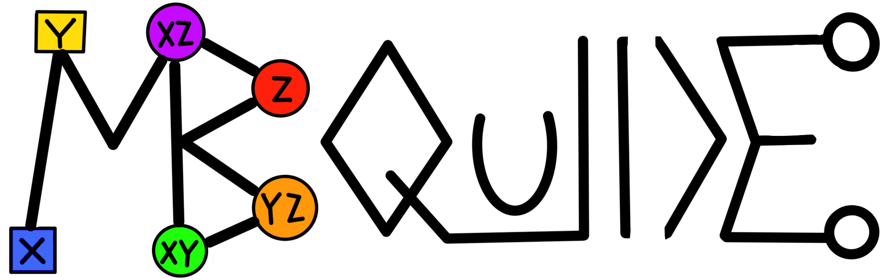

&nbsp;
<p align="center">
  <picture>
    <source media="(prefers-color-scheme: dark)" srcset="./frontend/src/assets/mbquide_darkmode.png">
    <source media="(prefers-color-scheme: light)" srcset="./frontend/src/assets/mbquide.png">
    
  </picture>
</p>

<h1 align="center">MBQuIDE</h1>
<p align="center">An interactive graphical editor for measurement-based quantum computing</p>

<p align="center">
  <a href="https://github.com/mnm-team/mbquide/releases/latest">
    
  </a>
  <a href="https://github.com/mnm-team/mbquide/blob/main/LICENSE">
    
  </a>
  
</p>

---


## Quick Start

Download and run a pre-built binary for your platform — no compiler needed.

### Linux (Ubuntu 24+)
```bash
mkdir -p MBQuIDE
cd MBQuIDE
curl -L https://github.com/mnm-team/mbquide/releases/latest/download/mbquide-v0.1.0-linux-ubuntu24.tar.gz | tar -xz
chmod +x Server launch.sh
./launch.sh
```

### Linux (Ubuntu 22)
```bash
mkdir -p MBQuIDE
cd MBQuIDE
curl -L https://github.com/mnm-team/mbquide/releases/latest/download/mbquide-v0.1.0-linux-ubuntu22.tar.gz | tar -xz
chmod +x Server launch.sh
./launch.sh
```

### macOS
```bash
mkdir -p MBQuIDE
cd MBQuIDE
curl -L https://github.com/mnm-team/mbquide/releases/latest/download/mbquide-v0.1.0-macos.tar.gz | tar -xz
chmod +x Server launch.sh
./launch.sh
```

### Windows

1. Download the [latest Windows release](https://github.com/mnm-team/mbquide/releases/latest)
2. Extract the zip
3. Open the extracted folder and double-click **`launch.bat`**
4. Open your browser at `http://localhost:18080`

Or via Command Prompt:
```cmd
curl -L -o mbquide.zip https://github.com/mnm-team/mbquide/releases/latest/download/mbquide-v0.1.0-windows.zip
tar -xf mbquide.zip
cd mbquide-v0.1.0-windows
launch.bat
```

Once running, open your browser at:

```
http://localhost:18080
```

---

## Build from Source

Follow these steps if you want to build MBQuIDE yourself.

### Prerequisites

**Backend (C++)**
- CMake ≥ 3.14
- A C++17-compatible compiler (e.g. GCC 9+, Clang 10+, MSVC 2019+)
- [Boost Graph library](https://www.boost.org/doc/libs/latest/libs/graph/doc/).

**Frontend (Web UI)**
- Node.js ≥ 20
- npm ≥ 9

---

### 1. Clone the repository

```bash
git clone https://github.com/mnm-team/mbquide.git
cd mbquide
```

### 2. Build the backend

```bash
cmake -S backend -B backend/build
cmake --build backend/build
```

### 3. Install frontend dependencies

```bash
cd frontend
npm install
cd ..
```

### 4. Run the application

```bash
bash start.sh
```

This starts both servers:

| Component | URL |
|-----------|-----|
| Backend API | `http://localhost:18080` |
| Frontend (dev) | `http://localhost:5173` |

Open `http://localhost:5173` in your browser to use the app.

---

## Project Structure

```
MBQuIDE/
├── backend/       # C++ backend server
├── frontend/      # Web-based UI (React)
└── README.md
```

